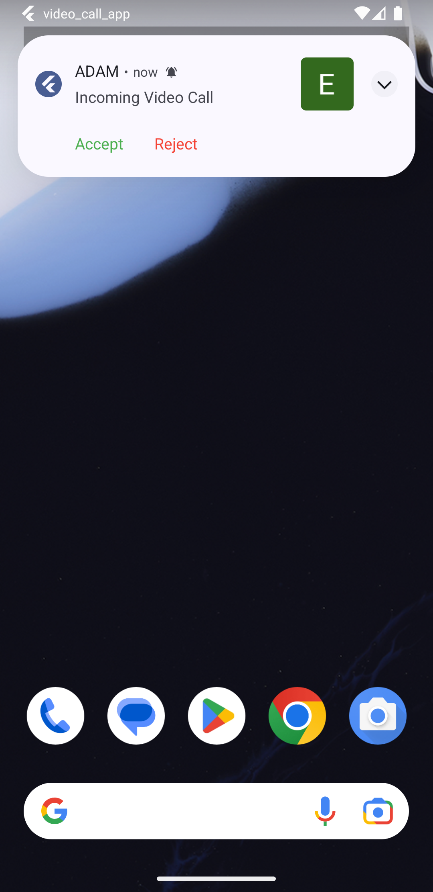

# Video Calling App - Flutter Firebase Agora

This repository contains the source code of a video calling app developed using the **Flutter**, **Firebase**, and **Agora SDK**. The app allows users to make video calls with other users, providing a seamless and immersive communication experience. [**Youtube Video**](https://youtu.be/wFZgwXUmKk8)

## Features

- **User Registration and Authentication**: Users can create an account, log in, and maintain their profile within the app.
- **Real-time Video Calling**: The app utilizes Agora SDK to establish real-time video calls between users, ensuring smooth and high-quality communication.
- **Push Notifications**: Users receive notifications for incoming calls, even when the app is in the background or closed.

## Technology Used

- [**Flutter**](https://flutter.dev/?gclid=Cj0KCQjwho-lBhC_ARIsAMpgMofnUxu0HHe9oEa4KZtmVOVmGzgoxIfG47wTqYwuZy0pvpPE3oCtjM8aAgTiEALw_wcB&gclsrc=aw.ds): The app is built using the Flutter framework, allowing for cross-platform development with a single codebase.
- [**Firebase**](https://firebase.google.com/?gad=1&gclid=Cj0KCQjwho-lBhC_ARIsAMpgMoc2vtlv-g8D-bgTSVPog2iDaeIMeOOMoVH2s_b3qGholLGgBYDiy9QaAu7NEALw_wcB&gclsrc=aw.ds): Firebase is used for user authentication, real-time database storage, and push notifications.
- [**Agora SDK**](https://www.agora.io/en/): Agora SDK enables real-time video calling functionality, providing low-latency, high-quality audio and video streams.

## Screenshots

## Contributing

Contributions are welcome! If you encounter any issues or have suggestions for improvements, please open an issue or submit a pull request.
